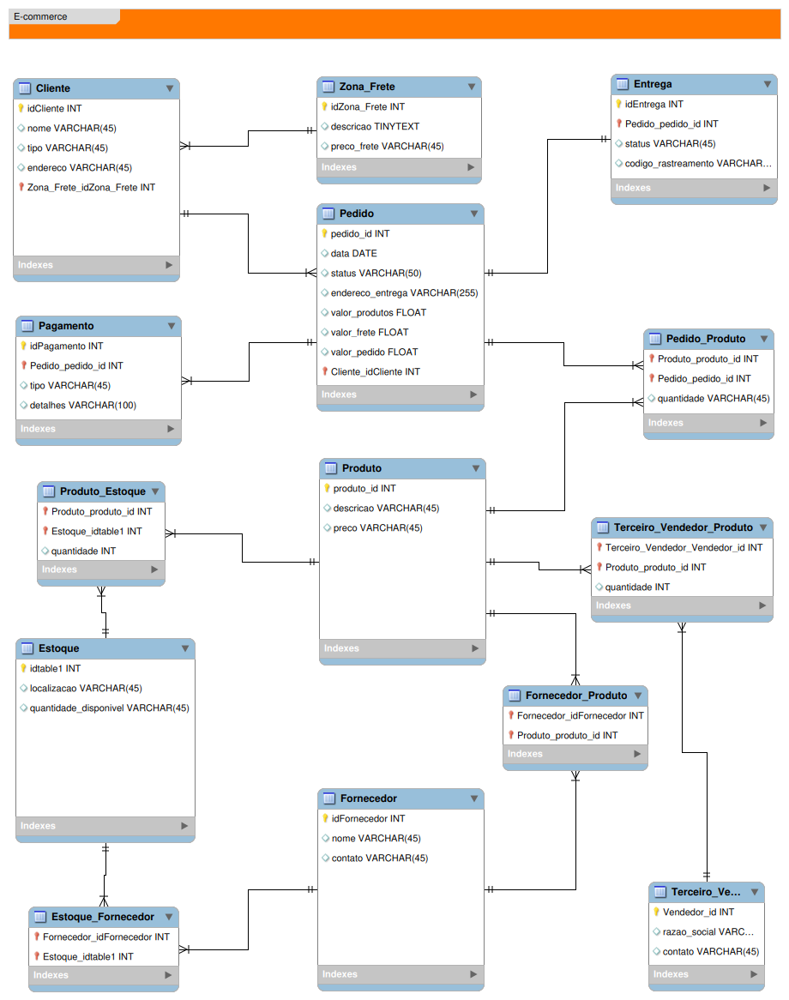

# Desafio de Projeto: Modelagem Conceitual de Banco de Dados para E-commerce

Este repositório contém a solução do desafio de projeto proposto pela [DIO](https://web.dio.me/home) no **Bootcamp Suzano - Análise de Dados com Power BI**. O objetivo foi modelar e refinar um banco de dados conceitual para um sistema de e-commerce.

## Descrição do Desafio

O desafio consiste em modelar um banco de dados para um sistema de e-commerce que atenda os seguintes requisitos:

### Narrativa - Produto (Fornecido pelo Instrutor)
- Os produtos são vendidos por uma única plataforma online. Contudo, estes podem ter vendedores distintos (terceiros)
- Cada produto possui um fornecedor
- Um ou mais produtos podem compor um pedido

### Narrativa - Cliente (Fornecido pelo Instrutor)
- O cliente pode se cadastrar no site com seu CPF ou CNPJ
- O Endereço do cliente irá determinar o valor do frete
- Um cliente pode comprar mais de um pedido. Este tem um período de carência para devolução do produto

### Narrativa - Pedido (Fornecido pelo Instrutor)
- O pedidos são criados por clientes e possuem informações de compra, endereço e status da entrega
- Um produto ou mais compoem o pedido
- O pedido pode ser cancelado

### Narrativa - Fornecedor (Criada de forma Participativa durante a criação do Modelo Inicial)
- Cada fornecedor é responsável por fornecer produtos à plataforma, mas não está diretamente relacionado ao controle do estoque.
- Um fornecedor pode fornecer diversos produtos distintos.
- Os fornecedores têm informações de contato cadastradas, que podem ser utilizadas para negociações ou consultas.

### Narrativa - Estoque (Criada de forma Participativa durante a criação do Modelo Inicial)
- O estoque registra a quantidade disponível de produtos para venda e sua localização.
- Cada estoque armazena diferentes produtos e quantidades.
- Fornecedores podem estar associados a diferentes estoques.


### Objetivo
Refinar o modelo inicial para incluir os seguintes pontos:

- **Cliente PJ e PF:** - Uma conta pode ser PJ ou PF, mas não pode ter as duas informações;

- **Pagamento:** - Pode ter cadastrado mais de uma forma de pagamento;

- **Entrega:** - Possui status e código de rastreio;

## Modelo Relacional Refinado

O modelo relacional refinado é representado pelo diagrama a seguir:



---

## Estrutura do Banco de Dados

1. **Cliente**
   - `idCliente` (chave primária)
   - `nome` (nome do cliente)
   - `tipo` (Pessoa Física ou Jurídica)
   - `endereco`
   - Relaciona-se com `Zona_Frete` para determinar o valor do frete.

2. **Zona_Frete**
   - `idZona_Frete` (chave primária)
   - `descricao` (descrição da zona)
   - `preco_frete` (valor do frete por zona)
   - Relaciona-se com `Cliente`.

3. **Pedido**
   - `pedido_id` (chave primária)
   - `data` (data do pedido)
   - `status` (ex.: em andamento, concluído, cancelado)
   - `endereco_entrega`
   - `valor_produtos`
   - `valor_frete`
   - `valor_pedido` (total do pedido)
   - Relaciona-se com `Cliente`, `Pagamento`, `Pedido_Produto` e `Entrega`.

4. **Pagamento**
   - `idPagamento` (chave primária)
   - `Pedido_pedido_id` (chave estrangeira para `Pedido`)
   - `tipo` (ex.: cartão, boleto)
   - `detalhes` (informações adicionais sobre o pagamento)
   - Permite múltiplas formas de pagamento para um único pedido.

5. **Entrega**
   - `idEntrega` (chave primária)
   - `Pedido_pedido_id` (chave estrangeira para `Pedido`)
   - `status` (status da entrega)
   - `codigo_rastreamento` (código de rastreamento da entrega)

6. **Produto**
   - `produto_id` (chave primária)
   - `descricao` (descrição do produto)
   - `preco` (preço unitário)
   - Relaciona-se com `Produto_Estoque`, `Fornecedor_Produto` e `Terceiro_Vendedor_Produto`.

7. **Produto_Estoque**
   - Tabela intermediária entre `Produto` e `Estoque`.
   - `Produto_produto_id` (chave estrangeira para `Produto`)
   - `Estoque_idtable1` (chave estrangeira para `Estoque`)
   - `quantidade` (quantidade de produtos em estoque específico)

8. **Estoque**
   - `idtable1` (chave primária)
   - `localizacao` (localização do estoque)
   - `quantidade_disponivel` (quantidade total disponível no estoque)

9. **Fornecedor**
   - `idFornecedor` (chave primária)
   - `nome` (nome do fornecedor)
   - `contato` (informações de contato)

10. **Fornecedor_Produto**
    - Tabela intermediária entre `Fornecedor` e `Produto`.
    - `Fornecedor_idFornecedor` (chave estrangeira para `Fornecedor`)
    - `Produto_produto_id` (chave estrangeira para `Produto`)

11. **Estoque_Fornecedor**
    - Tabela intermediária entre `Estoque` e `Fornecedor`.
    - `Estoque_idtable1` (chave estrangeira para `Estoque`)
    - `Fornecedor_idFornecedor` (chave estrangeira para `Fornecedor`)

12. **Terceiro_Vendedor**
    - `Vendedor_id` (chave primária)
    - `razao_social` (razão social do vendedor)
    - `contato` (informações de contato)

13. **Terceiro_Vendedor_Produto**
    - Tabela intermediária entre `Terceiro_Vendedor` e `Produto`.
    - `Terceiro_Vendedor_Vendedor_id` (chave estrangeira para `Terceiro_Vendedor`)
    - `Produto_produto_id` (chave estrangeira para `Produto`)
    - `quantidade` (quantidade de produtos oferecidos pelo vendedor)

14. **Pedido_Produto**
    - Tabela intermediária entre `Pedido` e `Produto`.
    - `Pedido_pedido_id` (chave estrangeira para `Pedido`)
    - `Produto_produto_id` (chave estrangeira para `Produto`)
    - `quantidade` (quantidade de produtos no pedido)

---

## Como Usar

1. Baixe ou clone este repositório:
   ```bash
   git clone https://github.com/seu-usuario/seu-repositorio.git


## Tecnologias Utilizadas
- **MySQL Workbench** para modelagem.
- **Banco de dados MySQL**.

## Sobre o Projeto
Este desafio faz parte do **Bootcamp Suzano - Análise de Dados com Power BI**, oferecido pela [DIO](https://web.dio.me/home). O objetivo foi aprimorar habilidades em modelagem e design de banco de dados, proporcionando uma experiência prática com cenários reais e exigências específicas do mercado.
